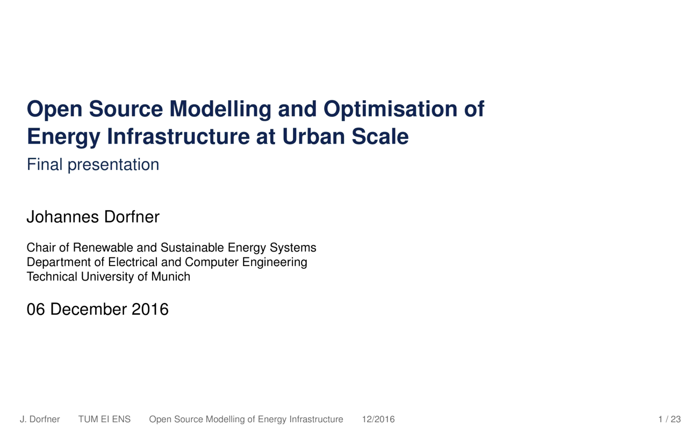

# Beamer presentation: thesis defense

These are the translated and slightly changed slides to my thesis defense presentation. I share them to archive some techniques for creating over-engineered overlay specifications, combined with a mixture of TikZ, matplotlib and geospatial visuals.

## Links

  - The thesis ([PDF full text](https://mediatum.ub.tum.de/doc/1285570/1285570.pdf)): [Open Source Modelling and Optimisation of Energy Infrastructure at Urban Scale ](https://mediatum.ub.tum.de/?id=1285570)
  - The models (GitHub repositories):
    * [tum-ens/**urbs**](https://github.com/tum-ens/urbs): A linear optimisation model for distributed energy systems *(most versatile; investment and operation planning for complex multi-commodity energy systems; draw-back: everything's linear)*
    * [tum-ens/**rivus**](https://github.com/tum-ens/rivus): A mixed integer linear optimisation model for energy infrastructure networks *(think: network planning for multiple commodities like electricity, natural gas and district heating)*
    * [tum-ens/**dhmin**](https://github.com/tum-ens/dhmin): Mathematical optimisation model for district energy distrubtion networks *(most specific: does cost-benefit trade-off for a single commodity distribution network)*

## Preview

*Preview via [Converting PDF slides to animated GIFs and videos with ImageMagick](http://phyletica.org/imagemagick/) by [Jamie Oaks](http://github.com/joaks1).*
